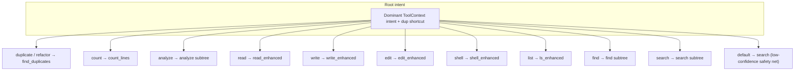
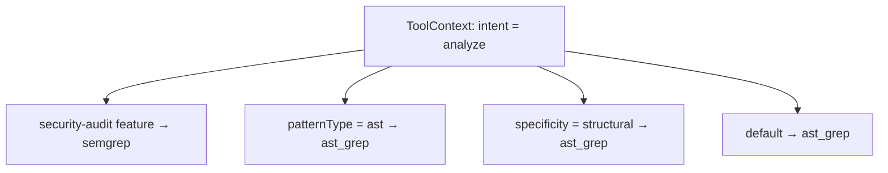
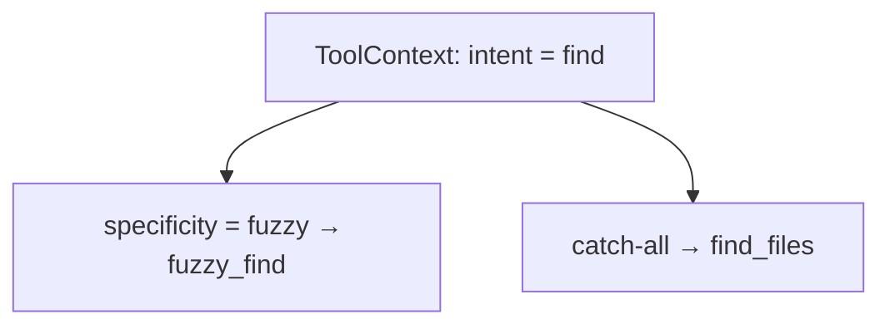
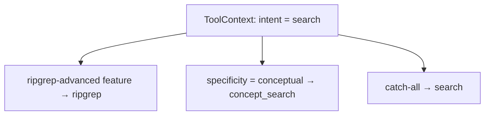

# Decision tree routing

pi-sherlock’s **decision tree** is a second opinion on tool choice: given a synthesized `ToolContext` from `src/routing/types.ts`, it walks **ordered branches** from `src/routing/tree-config.json`, picks the strongest matching child at each level, lands on exactly one leaf tool, then **adjusts confidence** using match richness and binary availability.

## Where it lives

| Piece | Role |
|--------|------|
| `src/routing/tree-config.json` | Versioned branching structure covering all fourteen tools |
| `src/routing/decision-tree.ts` | `DecisionTree.traverse()`, matching rules, scoring |
| `tests/routing/decision-tree.test.ts` | Exhaustive traversal, coverage, scoring, failure modes |

Integration with rule-based `DecisionEngine` in `src/routing/decision-engine.ts` (Task 4) will merge tree output with weighted confidence.

---

## Matching model

Each **branch option** optionally defines a `match` object. Empty or omitted `match` matches any context arriving at that node (used for safe defaults).

Supported criteria (AND semantics):

- `intent`, `specificity`, `scope` — singleton or array (context must equal one listed value)
- `hasPattern`, `patternType`
- `featuresAny` — at least one feature must appear in `context.features`
- `featuresAll` — every listed feature must be present

At each **branch node**, eligible children are filtered by `match`, sorted by `priority` (higher wins), then the first wins. If nothing matches and `defaultLeaf` exists, traversal uses `defaultLeaf` and records a `[default:…]` label (no redundant path segments).

---

## Confidence

For the chosen leaf:

1. Start from `leaf.baseConfidence`.
2. Add a **match-quality** bump from how many criterion fields were defined on that option (bounded).
3. Add a tiny bump from **`priority`** (strong routes can edge slightly higher).
4. If any `requiredBinaries` entry is unavailable in `context.binaryAvailability`, scale down (typically lower confidence without changing the recommended tool—that is left for the combined router).

Result is capped at **0.97**.

---

## High-level flow

---

## Analyze subtree (structural / security)

---

## Find subtree (file discovery)

---

## Search subtree (content)

`ripgrep-advanced` is ranked above conceptual overlap so **multiline / hidden / count-only** style queries still prefer `ripgrep` when the context analyzer tags that feature.

---

## Tool coverage map

| Category | Tools in tree |
|----------|----------------|
| Content search | `search`, `ripgrep`, `concept_search` |
| File discovery | `find_files`, `fuzzy_find` |
| Structural analysis | `semgrep`, `ast_grep` |
| Code metrics | `count_lines`, `find_duplicates` |
| File operations | `read_enhanced`, `write_enhanced`, `edit_enhanced` |
| System operations | `shell_enhanced`, `ls_enhanced` |

---

## Debugging

Call `DecisionTree.traverse(context)` and inspect:

- **`path`** — branch ids taken (omit synthetic defaults).
- **`pathLabels`** — questions plus chosen ids / default annotations.
- **`binariesSatisfied`** — whether all `requiredBinaries` probe as available.

For static validation in tests, `collectTreeTools` (in `src/routing/decision-tree.ts`) enumerates unique leaf tools in a config file.
